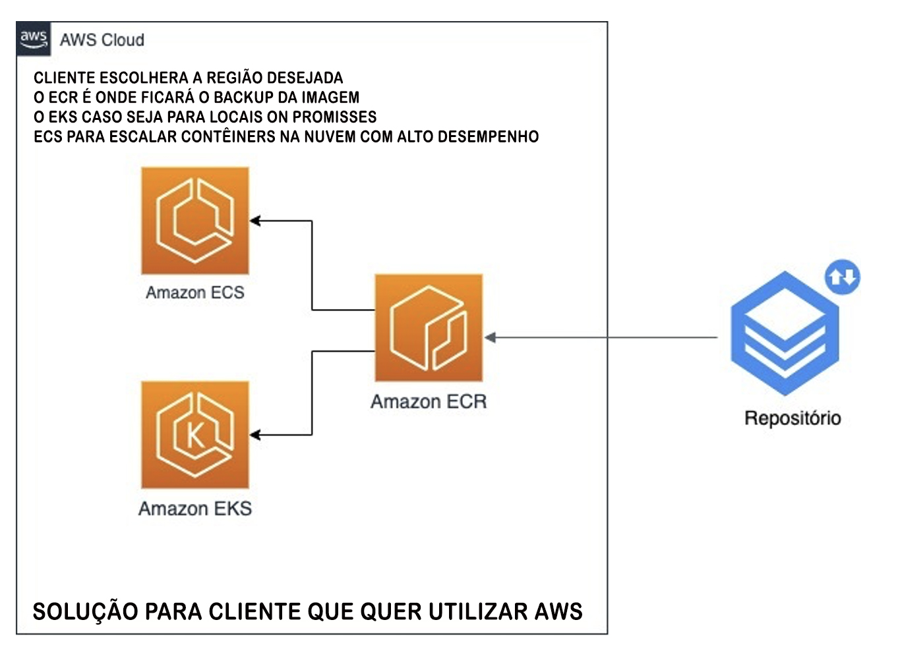

## RESUMO DESIGNER PATTERNS JS

- Aqui você encontrará o básico padrão de design implementado em JavaScript. Você pode usar o docs.md para uma visão geral rápida dos exemplos.

Segue a lista de padrões separados por tipo:

### PADRÕES CRIACIONAIS

- Padrões de criação são aqueles que criam os valores para manusear no fluxo de controle. O programa tem muita flexibilidade para decidir se quer incluir entradas ou saídas de valores.

### PADRÕES ESTRUTURAIS

- Estes dizem respeito à composição de classes e objetos. O programa tem a facilidade também de obter novas funcionalidades.

- Adaptador: permite que as classes com interfaces incompatíveis trabalhem juntas envolvendo o uso na interface.

- Ponte: Da tomadas de decisões fáceis com botão de atalho que faz com que possa remover os valores que não utiliza mais para atualização dentro da aplicação conforme desejar.

- Composto: compõe zero ou mais objetos semelhantes para que possam ser manipulados para adição, subtração e remoção de valores.

- Decorador: adiciona/substitui/remove dinamicamente o comportamento em um método existente do objeto.

- Fachada: fornece uma interface simplificada para um grande corpo de código.

- Flyweight: reduz o custo de criação e manipulação de um grande número de objetos semelhantes com as funções dentro do JAVASCRIPT.

- Rede: fornece um espaço reservado para criação de rede e outros objetos diferentes para controlar o acesso, reduzir custos e reduzir a complexidade.

### PADRÕES COMPORTAMENTAIS

- A maioria desses padrões de projeto preocupa-se especificamente com a comunicação entre objetos.

- Cadeia de responsabilidade: delegar comandos fáceis a uma cadeia de objetos de processamento.

- Comando: cria objetos que encapsulam ações e parâmetros.

- Intérprete: implementa uma linguagem especializada.

- Iterador: acessa os elementos de um objeto sequencialmente sem expor sua representação subjacente.

- Mediador: permite um baixo suporte na aplicação por ser detalhado em seus métodos.

- Memento: fornece a capacidade de restaurar um objeto ao seu estado anterior (desfazer).

- Observer: é um padrão de adicionar/excluir que permite que vários objetos observadores vejam as funções.

- Estado: permite que um objeto altere seu comportamento com a funcionalidade do appsite

- Estratégia: permite que caso precisar criar novas funcionalidades e novo desenvolvimento, pode ser utilizado as funções criadas para utilizar como base.

- Template: o método frontend define o esqueleto do projeto e o javascript com as funções por trás, permitindo um comportamento concreto.

## DESCRIÇÕES DO APPSITE

* Administrar ganhos e gastos (controle financeiro)
* Visualização do saldo de entrada e saída.
* Cadastro e exclusão de transações
.
- O projeto trata-se de um aplicativo de controle financeiro, com o intuito de prática com conceitos de HTML5, CSS3 e JS e solidificar alguns conceitos das tecnologias base do desenvolvimento front-end.


## TECNOLOGIAS UTILIZADAS
- Javascript - Html - Css


## FUNCIONALIDADES

- Modal com formulário para adição de transação
- Remoção de transação ao clique
- Validação client-side dos dados
- Armazenamento e persistência de dados com Local Storage
- Alteração de tema com JavaScript e variáveis CSS


## LAYOUT
```bash
- O layout do projeto foi restruturado por Davi Silva
```

## EXECUTAR PROJETO LOCAL

```bash
- Clone o projeto no HTTP do github

- Depois de clonado, acesse a pasta feito o download

- Abra o projeto clicando no arquivo index.html
```


## EXECUTAR PROJETO DOCKERFILE

```bash
- Clone o projeto no HTTP do github

- Depois de clonado, instalar o Docker no seu computador

- vá até a pasta onde está o arquivo Dockerfile

- rodar os dois comandos abaixo:

- docker build -t nityo-controle-fluxo/davi-versao:1.0 .

- docker run -d --name nityo-controle-fluxo -p 8080:80 nityo-controle-fluxo/davi-versao:1.0

- abrir projeto na porta localhost:8080
```

## 3 MODELOS BÁSICOS DE ARQUITETURA 
## PARA HOMOLOGAÇÃO E PRODUÇÃO DO APP-SITE



## LICENÇA ESTÁ NO PROJETO

```bash
O projeto está escrito e adicionado no arquivo LICENSE.
```

## DESENVOLVIDO POR
```bash
DAVI SILVA
EMAIL: devops.davi@gmail.com
LINKEDIN: https://www.linkedin.com/in/david-santos-b4678524a/
WHATSAPP: 1196378-1174
```
