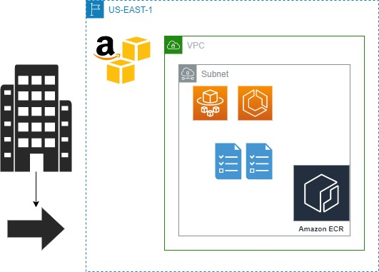
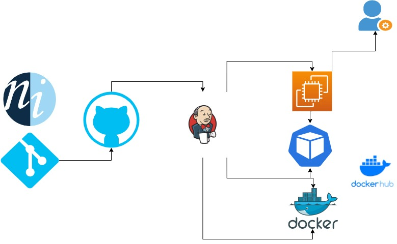

# DESCRIÇÕES DEVOPS
### DAVI SILVA
### EMAIL: devops.davi@gmail.com
### LINKEDIN: https://www.linkedin.com/in/david-santos-b4678524a/
### WHATSAPP: 119

## DESCRIÇÕES DO APPSITE

* Administrar ganhos e gastos (controle financeiro)
* Visualização do saldo de entrada e saída.
* Cadastro e exclusão de transações


## LINGUAGENS
- Javascript - Html - Css


## RODAR PROJETO LOCAL - SIMPLES

```bash
$ Clone o projeto no HTTP do github

$ Depois de clonado, acesse a pasta feito o download

$ Abra o projeto clicando no arquivo index.html
```


## RODANDO COM DOCKERFILE - SIMPLES

```bash
$ Clone o projeto no HTTP do github

$ Depois de clonado, instalar o Docker no seu computador

$ vá até a pasta onde está o arquivo Dockerfile

$ rodar os dois comandos abaixo:

$ docker build -t nityo-controle-fluxo/davi-versao:1.0 .

$ docker run -d --name nityo-controle-fluxo -p 8080:80 nityo-controle-fluxo/davi-versao:1.0
```

## LICENÇA ESTÁ NO PROJETO


## 3 MODELOS BÁSICOS DE ARQUITETURA 
## PARA HOMOLOGAÇÃO E PRODUÇÃO DO APP-SITE




